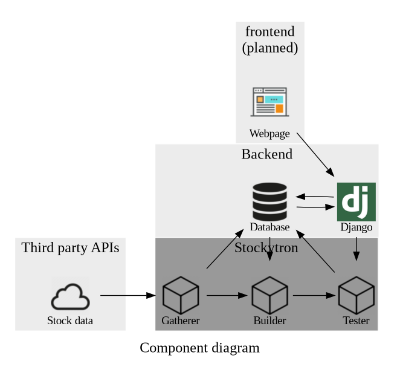
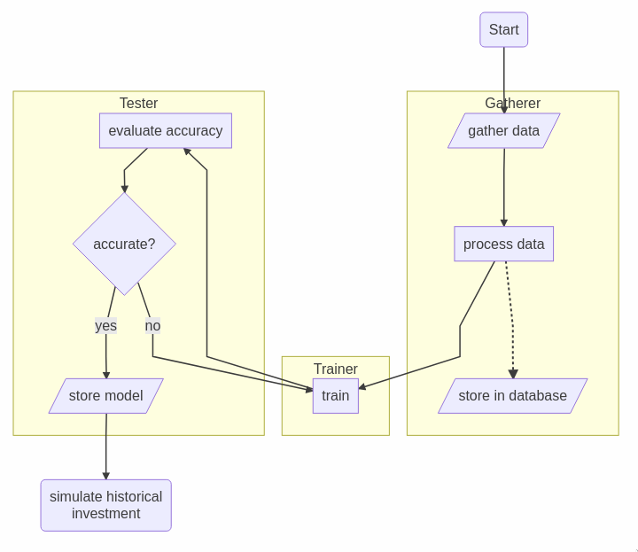

# Intro
Welcome to my project for gathering info on the stockmarket and trying out
prediction with machine learning.

Nice of you to drop by, but you should know that I do not recommend anyone to
trust or act on any predictions from this project to make any investments. I myself do not
this far and see this as a fun thing to do and learn about.

If you want recommendations on investments, look elsewhere. This ain't it chief.

# Dependencies
- [Python3](https://www.python.org/)
- [Numpy](https://pypi.org/project/numpy/)
- [Pandas](https://pypi.org/project/pandas/)
- [Matplotlib](https://pypi.org/project/matplotlib/)
- [Tensorflow](https://pypi.org/project/tensorflow/)
- [Keras](https://pypi.org/project/Keras/)

# Setup
Run the setup file with 'python3 setup.py' to install the required packages and
choose whether to use a gpu or cpu to train the model.
Be aware that in the current implementation, only GPUs that support CUDA can be
used due to tensorflow's implementation.

# Implementation progress
- [v] Gatherer
- [v] Builder
- [] Tester
- [] Webpage
- [] Django
- [] Database

## Component diagram
The components of the program can be seen in the diagram below.

## Flow diagram
The general planned flow of execution for the program can be seen in the diagram
below.

## Credits
Original state of the code with a LSTM model, as well as some of the learned knowledge was to no minor
degree thanks to [TannerGilbert tutorial](https://github.com/TannerGilbert/Tutorials) on the matter.
